# Ejercicios MySQL 3
1. Realizad sobre la base de datos “empresa” las siguientes consultas:
+ a. Listado de empleados con su respectivo superior
```sql
SELECT 
    e.nombre, s.nombre, s.cargo
FROM
    empleados AS e
        INNER JOIN
    empleados AS s ON (s.id_empleado = e.fid_superior)
```
Resultado<br> 
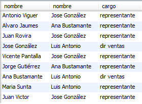

+ b. Listado anterior INCLUYENDO aquellos empleados que no tengan
superior.
```sql
SELECT 
    e.nombre, s.nombre, s.cargo
FROM
    empleados AS e
        LEFT OUTER JOIN
    empleados AS s ON (s.id_empleado = e.fid_superior)
```
Resultado<br> 
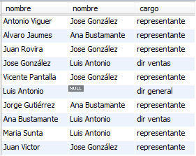

+ c. Listado de empleados con información sobre su oficina, tengan o no.
```sql
SELECT 
    e.nombre, o.id_oficina
FROM
    empleados AS e
        LEFT OUTER JOIN
    oficinas o ON (e.fid_oficina = o.id_oficina)
```
Resultado<br> 
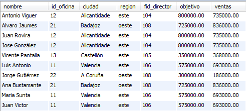

+ d. Listado de empleados con información sobre su venta de importe más
alto
```sql
select
e.id_empleado,e.nombre, max(p.importe_total)
from 
empleados e
inner join
pedido p on(p.fid_vendedor=e.id_empleado)
group by e.nombre 
order by p.importe_total desc
```
Resultado<br> 
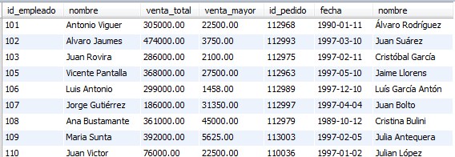

+ e. Listado de clientes cuyo número de pedidos sea superior a 2.
```sql
SELECT 
    c.nombre, COUNT(p.fid_cliente)
FROM
    clientes AS c
        RIGHT OUTER JOIN
    pedido AS p ON c.id_cliente = p.fid_cliente
GROUP BY p.fid_cliente
HAVING COUNT(p.fid_cliente) > 2;
```
Resultado<br> 


2. Realizar las siguientes actualizaciones sobre la base de datos “empresa”:
+ a. Actualizar los salarios de nuestros empleados de tal forma que el salario
de un empleado sea el 50% del objetivo de su oficina.
```sql
UPDATE empleados AS e,
    oficinas AS o 
SET 
    e.salario = o.objetivo * 50 / 100
WHERE
    e.fid_oficina = o.id_oficina;
```
Resultado<br> 
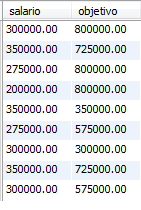
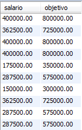

+ b. Poner a cero las ventas de los empleados de la oficina 12
```sql
UPDATE empleados AS e,
    oficinas AS o 
SET 
    e.ventas = 0
WHERE
    e.fid_oficina = o.id_oficina
        AND o.id_oficina = 12;
```
Resultado<br> 

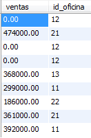

+ c. Poner a cero el límite de crédito de los clientes asignados a empleados de la oficina 12.
```sql
UPDATE clientes AS c,
    empleados AS e,
    pedido AS p 
SET 
    c.limitecredito = 0
WHERE
    p.fid_vendedor = e.id_empleado
        AND p.fid_cliente = c.id_cliente
        AND e.fid_oficina = 12;
```
Resultado<br> 
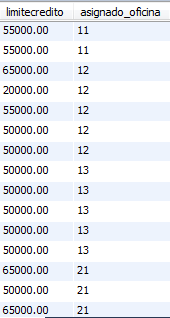


+ d. Borrar las líneas de pedido de los pedidos del cliente Jaime Llorens.
```sql
DELETE FROM linea_pedido 
WHERE
    fid_pedido IN (SELECT 
        p.id_pedido
    FROM
        clientes c
            INNER JOIN
        pedido p ON p.fid_cliente = c.id_cliente
    
    WHERE
        c.nombre = 'Jaime Llorens'); 
```
Resultado<br> 
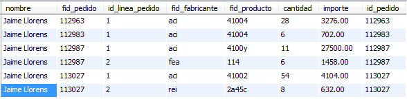


+ e. Aumentar un 5% el precio de todos los productos del fabricante ACI.
```sql
UPDATE productos 
SET 
    precio = precio + (precio * 0.05)
WHERE
    id_fabricante = 'aci';
```
Resultado<br> 
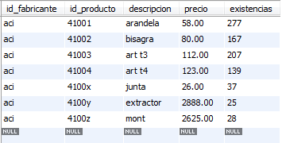


+ f. Añadir una nueva oficina para la ciudad de Madrid, con numero de oficina 30, un objetivo de 600 y región centro.
```sql
INSERT INTO oficinas VALUES(30,'Madrid','centro',NULL,600,NULL);
```
Resultado<br> 
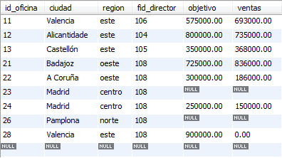


+ g. Cambiar los empleados de la oficina 21 a la oficina 30.
```sql
UPDATE empleados 
SET 
    fid_oficina = 30
WHERE
    fid_oficina = 21;
```
Resultado<br> 
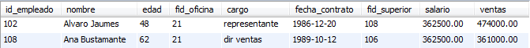
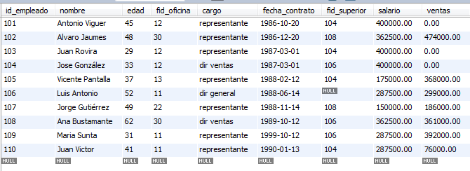

+ h. Eliminar los pedidos del empleado 105.
```sql
#pasamos la clave foranea a cascade
ALTER TABLE `empresa_copy`.`linea_pedido` 
DROP FOREIGN KEY `FK_pedido_linea_pedido`;
ALTER TABLE `empresa_copy`.`linea_pedido` 
ADD CONSTRAINT `FK_pedido_linea_pedido`
  FOREIGN KEY (`fid_pedido`)
  REFERENCES `empresa_copy`.`pedido` (`id_pedido`)
  ON DELETE CASCADE
  ON UPDATE CASCADE;
#eliminamos los pedidos del empleado 105 y a su vez se eliminan la linea de pedido asignados a esos pedidos
DELETE p FROM pedido as p
WHERE
    p.fid_vendedor = 105;
```
Resultado<br> 
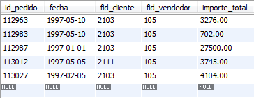


+ i. Subir un 10% el salario de los empleados cuya oficina haya superado sus objetivos de venta.
```sql
UPDATE empleados AS e,
    oficinas AS o 
SET 
    e.salario = e.salario + (e.salario * 0.1)
WHERE
    e.fid_oficina = o.id_oficina
        AND o.objetivo < o.ventas;
```
Resultado<br> 
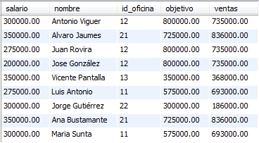
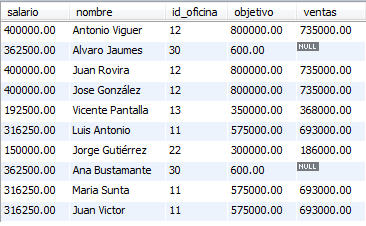

+ j. Eliminar las oficinas que no tengan empleados.
```sql

```
Resultado<br> 

